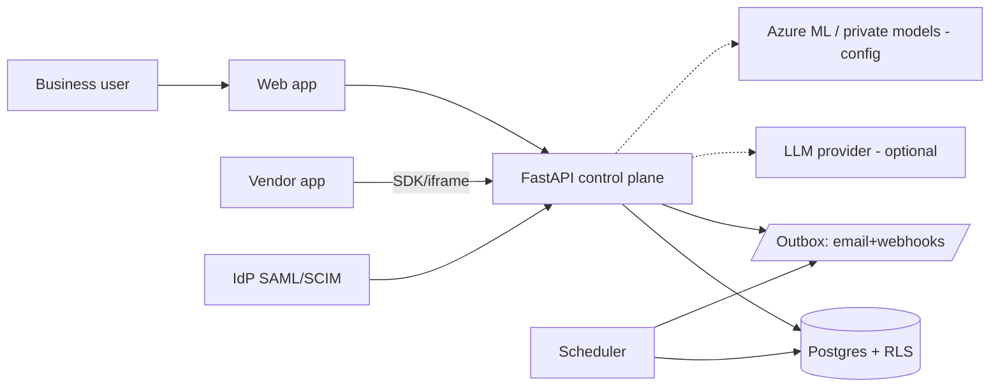
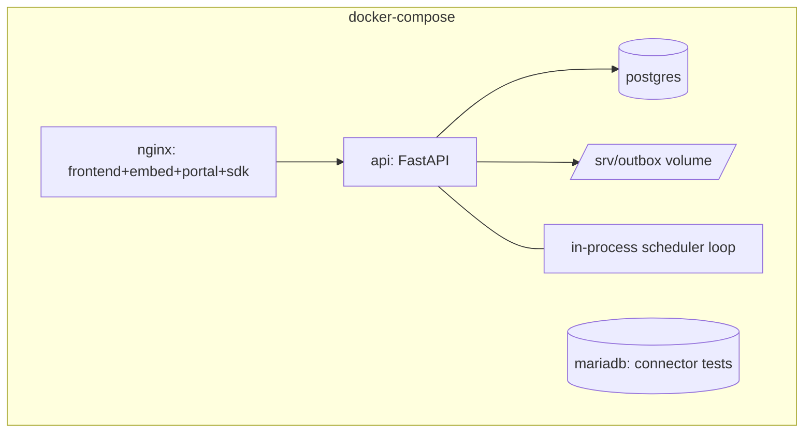
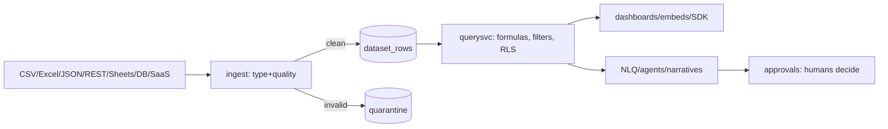
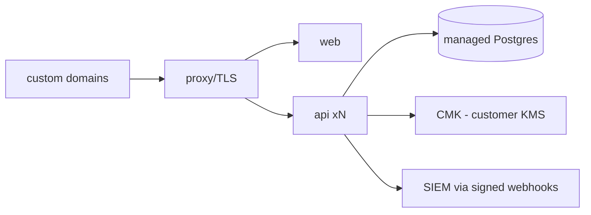
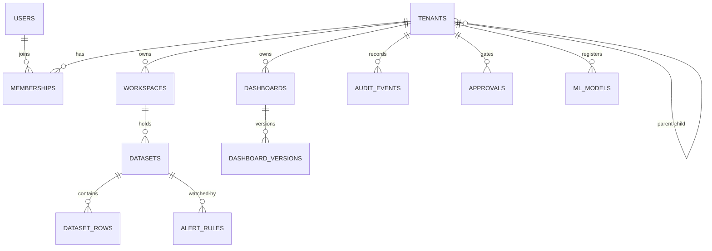

# Architecture Diagrams (Mermaid)

## Context

```mermaid
graph LR
U[Business user] --> W[Web app]
V[Vendor app] -->|SDK/iframe| API
I[IdP SAML/SCIM] --> API
W --> API[FastAPI control plane]
API --> PG[(Postgres + RLS)]
API --> OB[/Outbox: email+webhooks/]
S[Scheduler] --> PG
S --> OB
API -.-> LLM[LLM provider - optional]
API -.-> EXT[Azure ML / private models - config]
```

## Containers

```mermaid
graph TB
subgraph docker-compose
  web[nginx: frontend+embed+portal+sdk] --> api[api: FastAPI]
  api --> postgres[(postgres)]
  api --> outbox[/srv/outbox volume/]
  api --- sched[in-process scheduler loop]
  mariadb[(mariadb: connector tests)]
end
```

## Data flow

```mermaid
graph LR
SRC[CSV/Excel/JSON/REST/Sheets/DB/SaaS] --> ING[ingest: type+quality]
ING -->|clean| ROWS[(dataset_rows)]
ING -->|invalid| Q[(quarantine)]
ROWS --> QRY[querysvc: formulas, filters, RLS]
QRY --> DASH[dashboards/embeds/SDK]
QRY --> AI[NLQ/agents/narratives]
AI --> APPR[approvals: humans decide]
```

## Deployment (reference)

```mermaid
graph LR
DNS[custom domains] --> LB[proxy/TLS] --> WEB[web] & API2[api xN]
API2 --> DB[(managed Postgres)]
API2 --> KMS[CMK - customer KMS]
API2 --> SIEM[SIEM via signed webhooks]
```

## Core ERD (condensed)

```mermaid
erDiagram
  TENANTS ||--o{ MEMBERSHIPS : has
  USERS ||--o{ MEMBERSHIPS : joins
  TENANTS ||--o{ WORKSPACES : owns
  WORKSPACES ||--o{ DATASETS : holds
  DATASETS ||--o{ DATASET_ROWS : contains
  DATASETS ||--o{ ALERT_RULES : watched-by
  TENANTS ||--o{ DASHBOARDS : owns
  DASHBOARDS ||--o{ DASHBOARD_VERSIONS : versions
  TENANTS ||--o{ AUDIT_EVENTS : records
  TENANTS ||--o{ APPROVALS : gates
  TENANTS ||--o{ ML_MODELS : registers
  TENANTS ||--o{ TENANTS : parent-child
```
