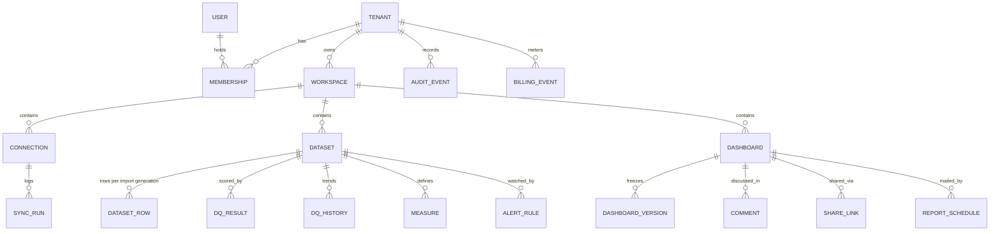

# Domain Model

Tenant 1—n Membership n—1 User; Tenant 1—n Workspace; Workspace 1—n
{Connection, Dataset, Dashboard}. Dataset 1—n DatasetRow (per import
generation), 1—n DQResult, 1—n DQHistory, 1—n Measure. Dashboard 1—n
DashboardVersion, 1—n Comment, 1—n ShareLink, 1—n ReportSchedule,
1—n AlertRule (via dataset). Every row carries tenant_id; PostgreSQL RLS
enforces isolation below the ORM (see THREAT-MODEL).

**Workspace = the project folder.** All documents for one initiative — its
source connections, the datasets they land, and the dashboards built on them
— live under one workspace. The UI's workspace switcher scopes every list;
creation flows default into the active workspace. Deleting is deliberately
absent in MVP (archive semantics come with retention policies).

Import generations: every ingest/recipe application writes a fresh
`import_id` set of rows and repoints `current_import_id` — queries are
snapshot-consistent, history is auditable, and lineage hops are appended.

Key invariants (enforced in code + tests):
* A row is never deleted by cleaning — it is superseded by a new generation.
* Published dashboard versions are frozen JSON snapshots (immutable).
* Share links expose only published snapshots, never live queries.
* recipe/apply re-processes ALL rows incl. quarantined (that's the rescue path).
## ER diagram

## Bounded contexts → code
| Context | Owns | Router / service |
|---|---|---|
| Identity & Access | users, sessions, MFA, RBAC | `routers/auth.py`, `security.py`, `roles.py` |
| Tenancy | orgs, memberships, invitations, audit | `routers/tenants.py`, `routers/workspaces.py`, `audit.py` |
| Billing & Entitlements | plans, limits, meters, billing events | `services/entitlements.py`, billing routes in `tenants.py` |
| Data Ingestion & Quality | imports, typing, DQ, quarantine, recipes | `services/ingest.py`, `routers/datasets.py` |
| Connectivity | catalog, credentials, syncs | `services/connectors/*`, `vault.py`, `syncsvc.py`, `routers/connections.py` |
| Analytics & Semantic layer | formulas, measures, hydration | `services/formulas.py`, `querysvc.py`, `routers/dashboards.py` |
| Distribution & Notifications | publish, shares, comments, reports, alerts, mail | `routers/dashboards.py`, `services/reportsvc.py`, `mailer.py` |
| Intelligence | forecasts, anomalies | `ml/insightforge_ml`, insights route in `datasets.py` |
| Platform Ops | tenant health, suspension | `routers/platform.py`, `frontend/src/ops.html` |

Contexts communicate only through the database (RLS-scoped) and in-process
service calls — no context reaches into another's tables directly from SQL.