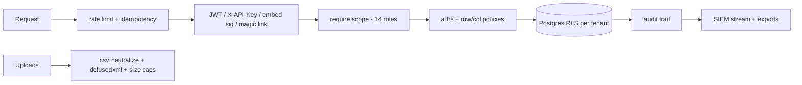
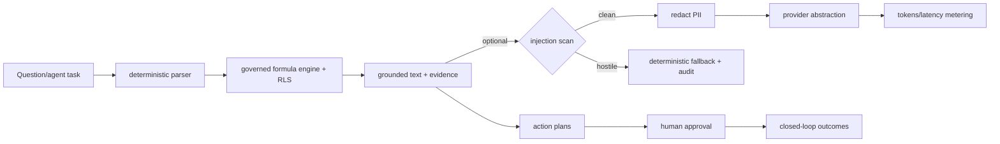
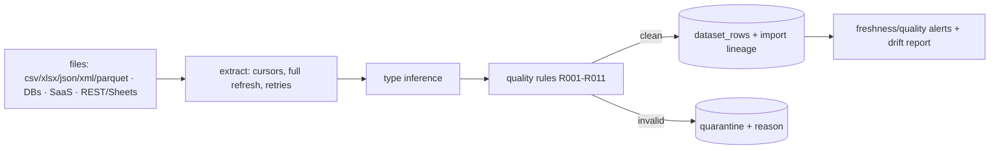
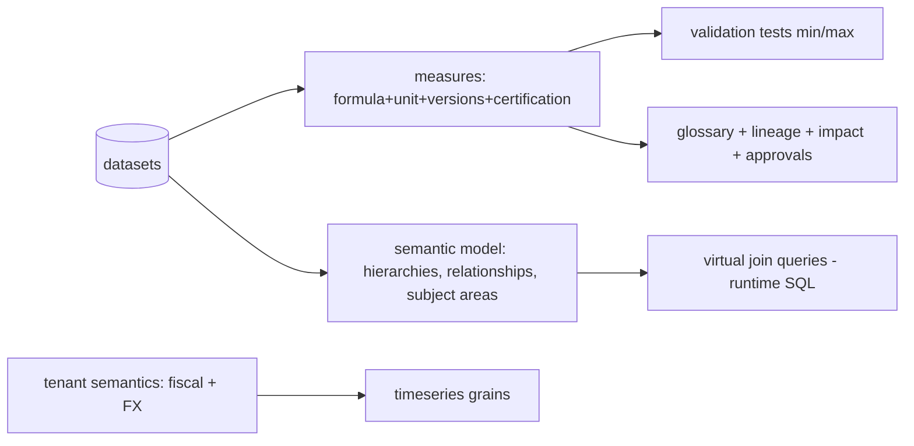
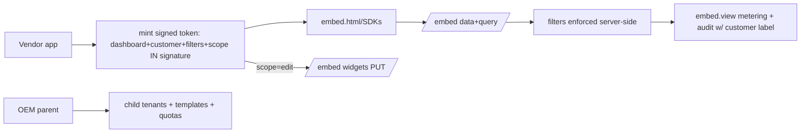
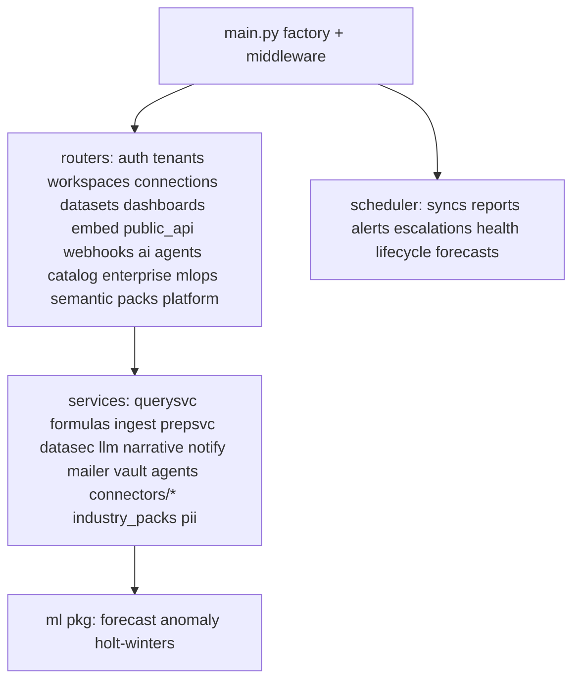

# Subsystem Architecture Diagrams

## Security architecture

## AI architecture

## Ingestion architecture

## Semantic architecture

## Embedded architecture

## Component diagram (control plane)

